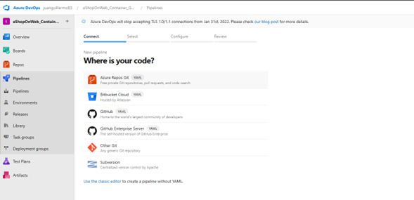
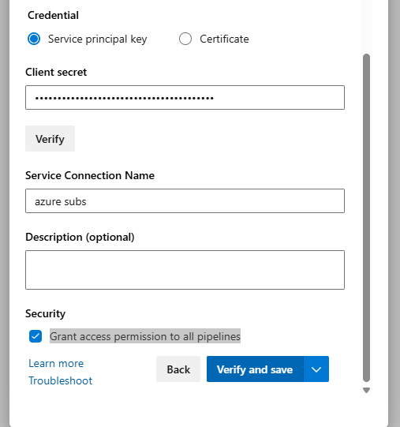

<div style="page-break-after: always;"></div>

## Inicio

<h1 style="text-align: center; font-size: 28px; margin-bottom: 5px;">
  Implementación de contenedores de Docker en aplicaciones web de Azure App Service
</h1>

<hr style="width: 60%; margin: 20px auto;">

<p style="text-align: center; font-size: 14px; margin: 5px;">
  <strong>Autor:</strong> Juan Guillermo Álvarez
</p>
<p style="text-align: center; font-size: 14px; margin: 5px;">
  <strong>Institución:</strong> SmartData
</p>
<p style="text-align: center; font-size: 14px; margin: 5px;">
  <strong>Fecha:</strong> Abril 2025
</p>

<div style="text-align: center; margin-top: 30px;">
  
</div>

<hr style="width: 60%; margin: 40px auto 20px;">

<blockquote style="font-size: 13px; text-align: center; color: #555;">
  Este documento presenta una guía práctica para la implementación de contenedores Docker<br>
  en aplicaciones web utilizando Azure App Service, destacando aspectos técnicos clave y buenas prácticas.
</blockquote>

<div style="page-break-after: always;"></div>

## Implementación de contenedores de Docker en aplicaciones web de Azure App Service

## Material:

* [AZ400_M02_L06_Deploy_Docker_containers_to_Azure_App_Service_web_apps.md](https://drive.google.com/file/d/1BK9fODSnAoWoPkNVassck2tvTeKwXhLv/view "Documento AZ400_M02_L06_Deploy_Docker_containers_to_Azure_App_Service_web")
* Repositorio [https://github.com/MicrosoftLearning/eShopOnWeb.git](https://github.com/MicrosoftLearning/eShopOnWeb.git "Repositorio https://github.com/MicrosoftLearning/eShopOnWeb.git")
* https://learn.microsoft.com/es-es/rest/api/azure/devops/?view=azure-devops-rest-7.2 apis
* https://github.com/ArmandoTG/aks.git  ejercicio 2 aksgd3

# Objetivos

* Crear un proyecto y cargar un repositorio en Azure Devops
* Configurar Pipelines
* Crear una imagen de Docker personalizada mediante un agente de Linux hospedado por Microsoft.
* Crear Un Azure container Registry
* Insertar una imagen en Azure Container Registry.
* Implementar una imagen de Docker como un contenedor en Azure App Service mediante Azure DevOps.

<div style="page-break-after: always;"></div>

# Desarrollo

## Crear un Repositorio en Azure Devops

1. Dirigite a Azure Devops y crea un nuevo proyecto
2. Presiona New project

   

<div style="page-break-after: always;"></div>

3. Completa el formulario de creación

   - Nombra el proyecto ( eShopOnWeb_Container_GD3 )
   - Visibility  Privada
   - Avanzado:  Git   y scrum

   
4. Importar

   

   <div style="page-break-after: always;"></div>
5. Clona el repositorio ( usa la url entregada al inicio del documento )

   [https://github.com/MicrosoftLearning/eShopOnWeb.git](https://github.com/MicrosoftLearning/eShopOnWeb.git "Repositorio https://github.com/MicrosoftLearning/eShopOnWeb.git")

   
6. Repositorio Cargado

   

<div style="page-break-after: always;"></div>

## Crear Pipelines CI y CD

#### Importar y ejecutar el pipeline CI

1. Pipelines -> pipelines

   
2. Azure Repos Git

   

<div style="page-break-after: always;"></div>

3. Selecciona el Repositorio

   
4. Opcion Existente azure pipeline YAML

   

<div style="page-break-after: always;"></div>

5. Selecciona eshoponweb-ci-docker.yml

   
6. Actual YAML cargado

   

<div style="page-break-after: always;"></div>

7. Actualizar los valores de las Variables, segun nuestros datos de conexion y servicios

   

<div style="page-break-after: always;"></div>

#### Importar y editar el pipeline CD Deploy

1. Repite los pasos 1 al 4 de la importacion de un pipeline [⬆️ Volver a la sección "Crear Pipelines CI y CD"](#crear-pipelines-ci-y-cd)

2. Selecciona Archivo YAML de Azure Pipelines existente

   - Seleccione la rama principal y el archivo /.ado/eshoponweb-cd-webapp-docker.yml

<!--     -->

   

   - presiona continuar

<div style="page-break-after: always;"></div>

#### Editar Pipeline Con Valores de conexion

1. ```
   azureServiceConnection: 'azure subs'  
   subscriptionId: 'xxxxx-xxxx-xxxx-xxxx-xxxxxx'
   resourceGroup: 'rg-az400-container-NAME'
   location: 'centralus'

   ```
2. Ir a azure Subscriptios

   
3. en la segunda columna se despliega el valor de ID de la suscripcion

   

<div style="page-break-after: always;"></div>

4. Nombre del resourceGroup

   a. rg-az400-RG1
5. Location

   a. 'centralus'

#### Crear Service Principal y Service Connection

1. Obtener el nombre de la suscripcion

   `subscriptionName=$(az account show --query name --output tsv)`
2. Obtener el ID de la suscripcion

   `subscriptionId=$(az account show --query id --output tsv)`
3. Chequear que los valores cargaron en las variables

   ```
   echo $subscriptionName
   echo $subscriptionId
   ```
4. Crear un service principal

   `az ad sp create-for-rbac --name sp-dockergd3-<XXX> --role owner --scopes /subscriptions/$subscriptionId`

   
5. Guardar el resultado

   
6. Ir a Azure devops para asociar el Service Principal con el Service Connection

   - project settings -> service connectios

   
7. Crear service Connections
   en el menu debes agregar  "Azure Resource Manager"

   

<div style="page-break-after: always;"></div>

8. Presiona "NEXT",  continua llenando el formulario

   

   a. Identity type :  App registration or managed identity (manual )
   b. credential : secret

   <!--  -->

   

<div style="page-break-after: always;"></div>

   c. completa el formulario con los datos obtenido en la creacion del service principal
   d. Verificar

<!--  -->


   e. Service Connection Name

   "azure subs"  Este nombre debe ser el mismo del pipeline

```
   variables:
     azureServiceConnection: 'azure subs'
     resourceGroup: 'rg-az400-RG1'
     location: 'centralus'
```

<!--   -->


<div style="page-break-after: always;"></div>

   f. Marcar  Grant access permission to all pipelines

<!--  -->


   g. Service Connection ha sido creado

   

<div style="page-break-after: always;"></div>

#### Actualizar y Ejecutar el Pipeline

1. Actualizamos

   
2. Save and validate

<!--   -->


<div style="page-break-after: always;"></div>

3. Ejecutar el pipeline en RUN

   
4. ejecucion

   

<div style="page-break-after: always;"></div>

5. Build CI

   
6. Deploy

   

<div style="page-break-after: always;"></div>

7. Verificar los recursos

   
8. ingresar al app service

   

<div style="page-break-after: always;"></div>

9. ir al browser

   

<div style="page-break-after: always;"></div>


## Reflexión sobre el proceso de ejecución

<div style="text-align: justify; font-size: 10px; max-width: 800px; margin: auto;">


  <p style="text-align: justify; font-size: 14px; line-height: 1.6; color: #444;">Durante la ejecución del laboratorio, tuve la oportunidad de profundizar en el uso de herramientas como Azure DevOps y Azure, lo que me permitió no solo completar las tareas asignadas, sino también comprender de manera más integral cómo se gestiona un flujo de trabajo en la nube.</p>

  <p style="text-align: justify; font-size: 14px; line-height: 1.6; color: #444;">Una de las principales dificultades que enfrenté fue la configuración inicial de los pipelines en Azure DevOps. Al principio, me costó entender cómo se definían los pasos del pipeline y cómo vincularlos correctamente al repositorio del proyecto. Sin embargo, investigando la documentación oficial y haciendo pruebas iterativas, logré superar esta barrera y automatizar correctamente los procesos de integración y despliegue continuo (CI/CD).</p>

  <p style="text-align: justify; font-size: 14px; line-height: 1.6; color: #444;">Otra dificultad fue la configuración de los recursos en Azure, particularmente el aprovisionamiento de máquinas virtuales y servicios asociados, donde fue necesario entender correctamente los grupos de recursos, políticas de seguridad y costos asociados. Esto me llevó a ser más consciente de la planificación de recursos y el control de versiones, elementos clave en cualquier entorno profesional.</p>

  <p style="text-align: justify; font-size: 14px; line-height: 1.6; color: #444;">Las herramientas utilizadas fueron esenciales para lograr un resultado exitoso. Azure DevOps permitió gestionar el trabajo de manera estructurada mediante tableros Kanban y tareas bien definidas, mientras que Azure facilitó el despliegue ágil y seguro de los componentes del sistema, promoviendo un enfoque moderno en la entrega de soluciones.</p>

  <p style="text-align: justify; font-size: 14px; line-height: 1.6; color: #444;">De este proceso aprendí la importancia de la automatización, la planificación y el monitoreo constante. También comprendí que seguir los pasos sin entender su propósito puede llevar a errores difíciles de detectar. Reflexionar sobre cada acción, validar resultados y aprovechar las herramientas disponibles me permitió mejorar mis competencias técnicas y fortalecer mi capacidad para resolver problemas en entornos reales de desarrollo y operaciones.</p>

</div>


<hr style="margin-top: 60px;">

<p style="text-align: center; font-size: 14px; line-height: 1.6; color: #444;">
  <strong>Juan Guillermo Álvarez</strong><br>
  <em>Ingeniero DevSecOps</em><br>
  Valparaíso, Chile – Abril 2025<br>
  <a href="https://www.linkedin.com/in/juan-guillermo-alvarez-gallardo/" target="_blank" style="color: #0077b5; text-decoration: none;">
    linkedin.com/in/juan-guillermo-alvarez-gallardo
  </a>
</p>
